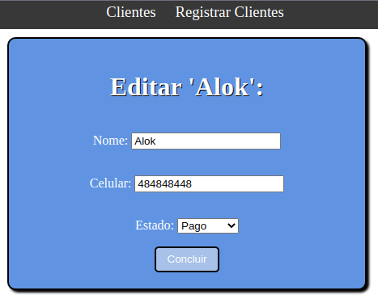

# cadastro-clientes

Sistema de cadastro de clientes com as quatro operações básicas do CRUD (Create, Read, Update, Delete).

## Página para adicionar clientes (Create)

## Pagina com o nome de todos os clientes (Delete)

## Pagina com as informações do cliente (Read)

## Pagina editando as informações do cliente (Update)
   