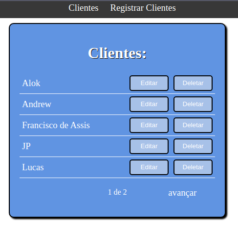

# cadastro-clientes

Sistema de cadastro de clientes, os clientes são registrado (por enquanto via django-admin), e suas informações podem ser verificadas em uma página própria.

## Adicionando com o Django-admin

## Pagina com o nome de todos os clientes

## Pagina com as informações do cliente
